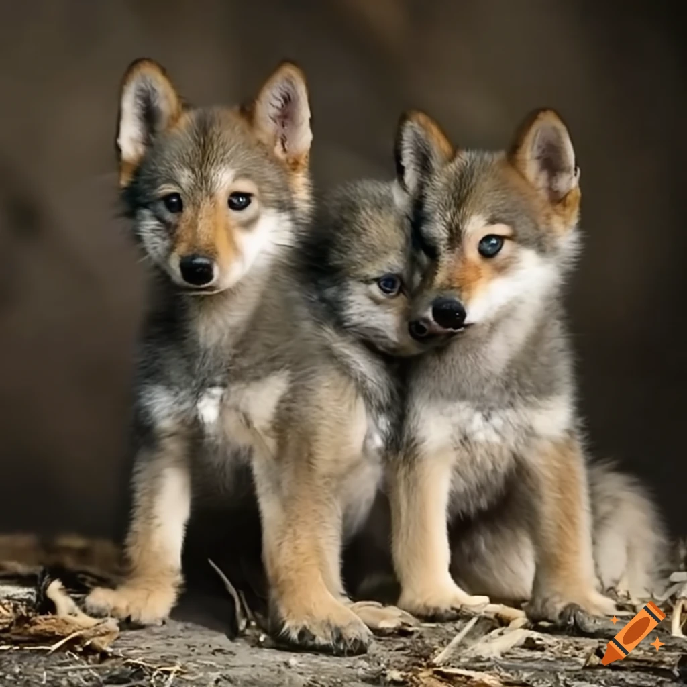

<h1 align="center">
qa-pup
</h1>

Small-scale, serverless clone of QA Wolf.

This repository contains the frontend, backend, and infrastructure for the project.

From <a href="https://www.craiyon.com/image/BZu9J-aJQPW_-iqgmX4tvw"> https://www.craiyon.com/image/BZu9J-aJQPW_-iqgmX4tvw </a>