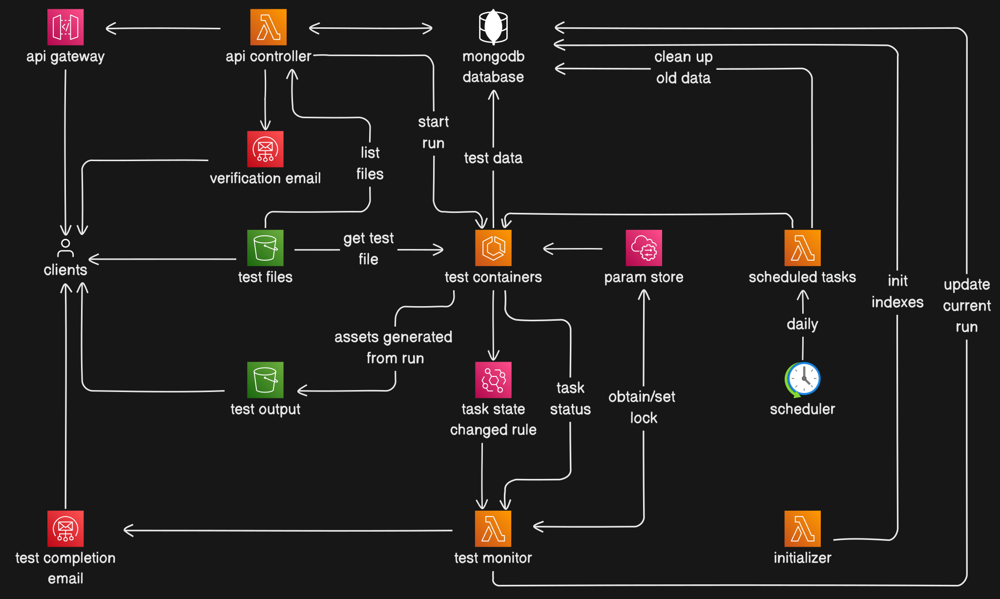

# qa-pup-cloud

This folder contains the cloud configuration for the project using Terraform. The backend for the providers are local, meaning terraform state will be stored locally inside this folder. To handle deploying & tearing down the application, it's recommended that you use a variable definition file (`.tfvars`, [see more](https://developer.hashicorp.com/terraform/language/values/variables#variable-definitions-tfvars-files)).

Command Reference:

- Initialize terraform: `terraform init`
- Preview changes: `terraform plan --var-file=variables.tfvars`
- Deploy the application: `terraform apply --var-file=variables.tfvars --auto-approve`
- Tear down the application: `terraform destroy --var-file=variables.tfvars --auto-approve`

*NOTE: Make sure you empty out your S3 buckets before deletion, or else you may encounter errors.*

## Cloud Architecture

